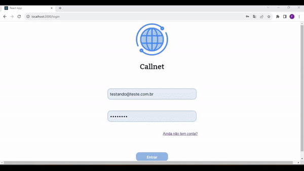
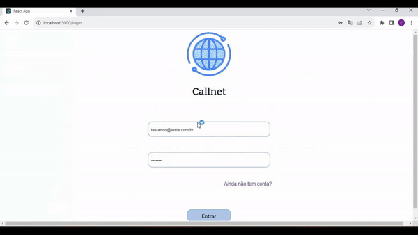
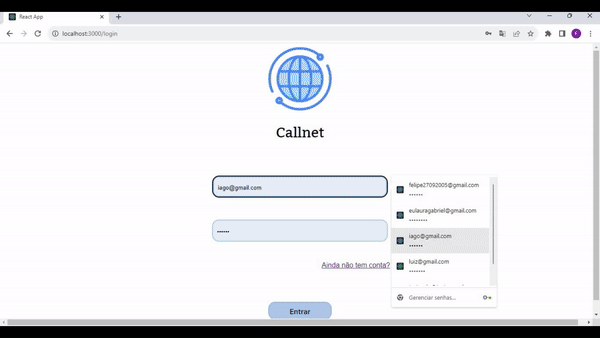

<!-- Para melhor visualização do código, tire a quebra de linha automatica. -->
 

<h1> FATEC Profº Jessen Vidal - São José dos Campos - 2º Semestre DSM </h1>
Projeto desenvolvido para a API (Aprendizagem por Projeto Integrado) do 2° semestre de Desenvolvimento de Software Multiplataforma (DSM). O projeto se refere à um sistema de Gestão de Chamadas de Serviço. A plataforma deve conter informações detalhadas sobre a disponibilização de funcionalidades sobre o planejamento, além do acompanhamento completo e controle no atendimento das chamadas.

 

<h2> 📑 Sobre o Projeto </h2>

O sistema que será desenvolvido, chamado CallNet, é focado em fornecer auxílio aos problemas relacionados a Internet Fixa, e busca aprimorar o sistema de Gerenciamento de Chamadas de Serviço. Nosso objetivo é que nossos clientes tenham acesso à soluções de seus problemas sobre Internet, de forma mais rápida e eficaz. 

 

<h3> 📌 Status do projeto: Em andamento ⏳ </h3>

 

<h3> 🧰 Tecnologias utilizadas até o momento: </h3>

    
    
    
    
    
    
    
    
    
    
    

    

 

<h2> 🎯 MVP </h2>## 📌 Entregas da quarta sprint do 2° semestre de DSM

| ID | Tarefa | User Story correlata | Estimativa de Esforço (h) |
| --- | ------ | --------------------- |  -------------------------- |
| 103 | Fazer com que na tela home do cliente apareça todas as soluções já conhecidas para os problemas comuns (com base nas pesquisas da sprint 1) buscando os dados do banco de dados {FRONT} | 9 | 4 |
| 103 | Fazer a rota e a função responsável por buscar no banco de dados todas as soluções já conhecidas para os problemas comuns (com base nas pesquisas da sprint 1) {BACK} | 9 | 4 |
| 106 | Gerenciar soluções de problemas comuns | 105 | 10 |
| 74 | Filtro de chamadas por temas e prioridades | 71 | 10 |
| 110 | Manual do usuário | - | 2 |
| 111 | Alterar a prioridade da chamada de acordo ao decorrer do tempo | - | 10 |
| 113 | Gerar relatórios analíticos | 14 | 10 |
<h3> Este é O MVP do produto: </h3>
<h4> Visão do Cliente </h4>
<h5> Visualizar soluções para problemas comuns, abertura e visualização de chamado: </h5>

<h4> Visão do Administrador </h4>
<h5> Atribuição de atendente, relatórios analíticos, gerenciar soluções para problemas comuns e cadastro de cliente: </h5>

<h4> Visão do Atendente </h4>
<h5> Atendimento do chamado: </h5>

 

Para acessar o Wireframe clique <a href="https://www.figma.com/file/LpX5SJ6WY8WJsfpQN0jlbp/Protótipo-API-2023.2?type=design&node-id=0-1&mode=design&t=ux9UagAZET3VBtz0-0">aqui!</a>

 

<h2> 🚩 Sprints </h2>

| Sprint |   Início   |  Entrega   |                                      Relatório                                      | Status |
| :----: | :--------: | :--------: | :---------------------------------------------------------------------------------: | :----: |
|   01   | 04/09/2023 | 24/09/2023 | [Relatório](https://github.com/Equipe-CodeLand/API-2023.2/releases/tag/sprint-1)                                                                                 |    ✔️    |
|   02   | 25/09/2023 | 15/10/2023 | [Relatório](https://github.com/Equipe-CodeLand/API-2023.2/releases/tag/sprint-2)                                                                                  |    ✔️    |
|   03   | 16/10/2023 | 05/11/2023 | [Relatório](https://github.com/Equipe-CodeLand/API-2023.2/releases/tag/sprint-3)                                                                                 |    ✔️    |
|   04   | 06/11/2023 | 26/11/2023 | ---                                                                                 |    ⏳    |

 

<h2> Épicos (Requisitos Funcionais) </h2>

<table>
    <tr>
        <th> ID </th>
        <th> Requisito </th>
        <th> Prioridade </th>
    </tr>
    <tr>
        <td> 33 </td>
        <td> Realizar chamadas de serviço </td>
        <td> Alta </td>
    </tr>
    <tr>
        <td> 34 </td>
        <td> Painel de chamadas em aberto </td>
        <td> Alta </td>
    </tr>
    <tr>
        <td> 35 </td>
        <td> Atendimento da chamada </td>
        <td> Alta </td>
    </tr>
    <tr>
        <td> 36 </td>
        <td> Cadastro de usuários </td>
        <td> Média </td>
    </tr>
    <tr>
        <td> 37 </td>
        <td> Login no sistema </td>
        <td> Média </td>
    </tr>
    <tr>
        <td> 38 </td>
        <td> Gerar relatórios analíticos </td>
        <td> Baixa </td>
    </tr>
    <tr>
        <td> 39 </td>
        <td> Soluções para problemas comuns </td>
        <td> Baixa </td>
    </tr>
    <tr>
        <td> 69 </td>
        <td> Filtrar chamadas </td>
        <td> Baixa </td>
    </tr>
</table>

<h2> 📜 Backlog Total </h2>

<table>
    <tr>
        <th> Épico ID </th>
        <th> Story ID </th>
        <th> História </th>
        <th> Prioridade </th>
        <th> User Story Points </th>
    </tr>
    <tr>
        <td> 33 </td>
        <td> 31 </td>
        <td> Como cliente, eu quero poder escolher o tópico que melhor se encaixa com meu problema, para assim iniciar minha chamada de serviço. </td>
        <td> Alta </td>
        <td> 13 </td>
    </tr>
    <tr>
        <td> 34 </td>
        <td> 8 </td>
        <td> Como administrador, eu quero poder ver todas as chamadas em aberto e seus dados, para assim poder acompanhar os processos de atendimento </td>
        <td> Alta </td>
        <td> 13 </td>
    </tr>
    <tr>
        <td> 34 </td>
        <td> 15 </td>
        <td> Como cliente, eu quero poder visualizar as chamadas iniciadas por mim. </td>
        <td> Alta </td>
        <td> 21 </td>
    </tr>
    <tr>
        <td> 34 </td>
        <td> 10 </td>
        <td> Como atendente, eu quero poder ver todos os chamados sem atendentes e poder iniciá-lo por conta própria, para assim poder agilizar o processo de atendimento </td>
        <td> Alta </td>
        <td> 21 </td>
    </tr>
    <tr>
        <td> 34 </td>
        <td> 55 </td>
        <td> Como atendente, eu quero poder visualizar os chamados que estou responsável, para assim poder atender estas chamadas. </td>
        <td> Alta </td>
        <td> 21 </td>
    </tr>
    <tr>
        <td> 34 </td>
        <td> 11 </td>
        <td> Como adm, eu quero poder atribuir um atendente a uma chamada, para assim poder agilizar o processo de atendimento </td>
        <td> Alta </td>
        <td> 34 </td>
    </tr>
    <tr>
        <td> 36 </td>
        <td> 7 </td>
        <td> Como adm, eu quero poder cadastrar usuários no sistema, desde outros administradores, atendentes ou clientes. </td>
        <td> Alta </td>
        <td> 21 </td>
    </tr>
    <tr>
        <td> 35 </td>
        <td> 32 </td>
        <td> Como atendente, eu quero poder abrir a thread da chamada e me comunicar com o cliente </td>
        <td> Média </td>
        <td> 21 </td>
    </tr>
    <tr>
        <td> 35 </td>
        <td> 73 </td>
        <td> Como cliente, eu quero poder abrir a thread da chamada e poder me comunicar com o atendente, para assim tentar resolver meu problema </td>
        <td> Média </td>
        <td> 21 </td>
    </tr>
    <tr>
        <td> 36 </td>
        <td> 40 </td>
        <td> Como usuário, eu quero poder me cadastrar no sistema, podendo assim fazer meu login e entrar no site </td>
        <td> Média </td>
        <td> 13 </td>
    </tr>
    <tr>
        <td> 37 </td>
        <td> 6 </td>
        <td> Como usuário, eu quero poder logar no sistema, para poder iniciar minhas chamadas de serviço. </td>
        <td> Média </td>
        <td> 34 </td>
    </tr>
    <tr>
        <td> 39 </td>
        <td> 9 </td>
        <td> Como cliente, eu quero ver soluções que podem resolver meu problema, antes de iniciar minha chamada, para assim agilizar o processo. </td>
        <td> Baixa </td>
        <td> 5 </td>
    </tr>
    <tr>
        <td> 39 </td>
        <td> 14 </td>
        <td> Como adm, quero poder gerar relatórios analíticos das chamadas, exemplo: tópicos com mais chamadas, horários de maior fluxo de chamadas, tempo médio de resolução, níveis de prioridade </td>
        <td> Baixa </td>
        <td> 34 </td>
    </tr>
    <tr>
        <td> 39 </td>
        <td> 105 </td>
        <td> Como adm, quero poder adicionar, editar ou excluir soluções para problemas comuns dos chamados, para assim ajudar o cliente rapidamente e reduzir o fluxo de chamados. </td>
        <td> Baixa </td>
        <td> 34 </td>
    </tr>
    <tr>
        <td> 69 </td>
        <td> 71 </td>
        <td> Como atendente, eu quero poder filtrar as chamadas de acordo com o seu tema ou sua prioridade, para assim poder agilizar meu atendimento as chamadas </td>
        <td> Baixa </td>
        <td> 21 </td>
    </tr>
</table>

 

<h2> DoR e DoD </h2>

<table>
    <tr>
        <th> DoR </th>
        <th> DoD </th>
    </tr>
    <tr> 
        <td>Wireframe</td>
        <td> Apresentar um código limpo para simplificar manutenções e adições futuras </td>
    </tr>
    <tr>
        <td> Backlog </td>
        <td> Cumprir claramente os critérios de aceitação previstos </td>
    </tr>
    <tr>
        <td> Modelo de Dados </td>
        <td> Testes para garantir que a tarefa realmente cumpre sua função com êxito </td>
    </tr>
    <tr>
        <td> User Stories </td>
        <td> Verificação de erros ou bugs que podem comprometer tarefas futuras </td>
    </tr>
    
</table>

 

<h2> 👨‍💻 Equipe </h2>
    
<table>
    <tr>
        <th> Foto </th>
        <th> Função </th>
        <th> Nome </th>
        <th> Linkedin </th>
        <th> Git Hub </th>
    </tr>
    <tr>
          <td>  </td>
          <td> Scrum Master </td>
          <td> Letícia Helena de Oliveira Carvalho </td>
          <td>  </td>
          <td>  </td>
    </tr>
    <tr>
        <td> </td>
        <td> Product Owner </td>
        <td> Felipe Gabriel Vieira </td>
        <td>  </td>
        <td>  </td>
    </tr>
  <tr>
        <td>  </td>
        <td> Dev Team </td>
        <td> Iago Cardoso Souza </td>
        <td>  </td>
        <td>  </td>
    </tr>
    <tr>
        <td>  </td>
        <td> Dev Team </td>
        <td> Laura Gabriel Gonçalves </td>
        <td>  </td>
        <td>  </td>
    </tr>
    <tr>
        <td>  </td>
        <td> Dev Team </td>
        <td> Livia Alves de Faria </td>
        <td>  </td>
        <td>  </td>
    </tr>
    <tr>
        <td>  </td>
        <td> Dev Team </td>
        <td> Luiz Felipe dos Santos </td>
        <td>  </td>
        <td>  </td>
    </tr>
    <tr>
          <td>  </td>
          <td> Dev Team </td>
          <td> Pedro Henrique de Souza </td>
          <td>  </td>
          <td>  </td>
      </tr>
</table>
    
 

<a href="#topo">[Voltar ao topo]</a>
